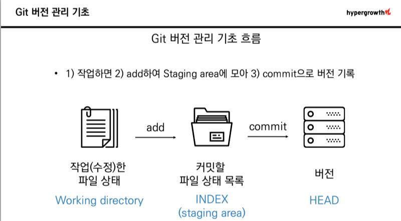
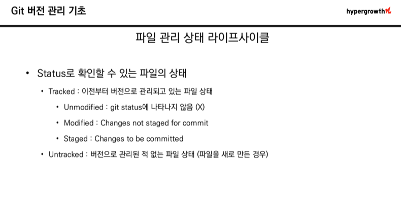
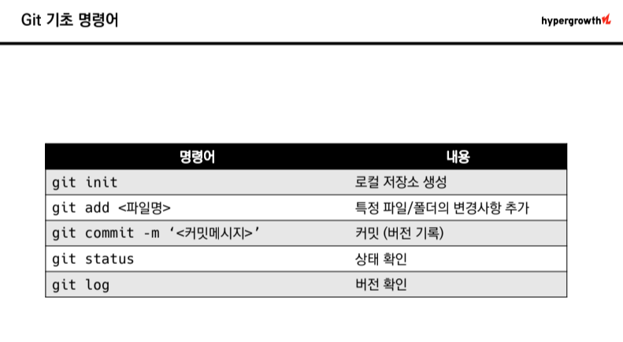

# Git

> ## Git이란? 
- 분산형 버전 관리 시스템 -> 원래는 Linux 소스코드를 관리할 목적으로 개발됨
- Git에서는 소스 코드가 변경된 이력을 쉽게 확인 가능
- 특정 시점에 저장된 버전과 비교하거나 특정 시점으로 되돌아 갈 수 있음
- *내가 올리려던 파일이 누군가 편집한 내용과 충돌한다면, 서버에 업로드 할 때 경고 메시지가 발생*

> ## 원격 저장소와 로컬 저장소
- 원격 저장소(Remote Repository) : 파일이 원격 저장소 전용 서버에서 관리되며 여러 사람이 함께 공유하기 위한 저장소이다.
- 로컬 저장소(Local Repository) : 내 PC에 파일이 저장되는 개인 전용 저장소이다.

```
본인이 로컬 저장소에서 작업한 내용을 공개하고 싶을 때 '원격 저장소'에 업로드하면 원격 저장소에서 다른 사람이 작업한 파일을 로컬 저장소로 가져올 수 있음
```
---

[Git 입문 링크](https://backlog.com/git-tutorial/kr/intro/intro4_1.html)

[버전 관리란?](https://git-scm.com/book/ko/v2/%EC%8B%9C%EC%9E%91%ED%95%98%EA%B8%B0-%EB%B2%84%EC%A0%84-%EA%B4%80%EB%A6%AC%EB%9E%80%3F)

[git config 설명](https://www.daleseo.com/git-config/)

---
> ## Git 요약






