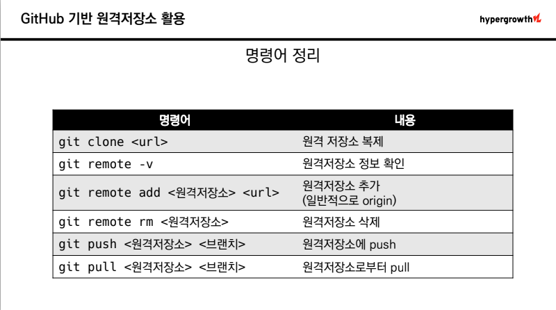
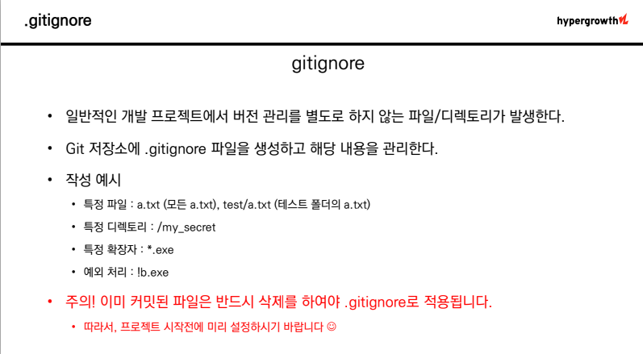

# 원격저장소

## clone과 pull의 차이점
- clone : 원격저장소 복제, 원격에 있는 프로젝트 시작할 때(협업)
- pull : 원격저장소 커밋 가져오기, 프로젝트 개발 중 다른 사람 커밋 받아올 때
---

## pull vs push
- push : 로컬 저장소의 버전을 원격저장소로 보낸다
- pull : 원격저장소의 버전을 로컬 저장소로 가져온다
---

## 명령어 정리


---

## Push Conflict
- $ git push origin master 입력 시 오류발생
- 이유: 로컬과 원격 저장소의 커밋 이력이 다르기 때문 ```$ git log --oneline```
- 해결방법
  - 원격 저장소의 커밋을 원격 저장소로 가져와서(pull)
  - 로컬에서 두 커밋을 병합(추가 커밋 발생)
    동시에 같은 파일 수정 시 merge conflict 발생 (브랜치 학습 필요)
    [브랜치](https://backlog.com/git-tutorial/kr/stepup/stepup1_1.html)
  - 다시 github로 push
---

## .gitignore
- git을 사용한 프로젝트 할 때 버전 관리를 별도로 할 필요 없는 파일
- 원격 저장소에 push 하고 싶지 않은 파일을 설정할 때 씀
  - NodeJS-Express로 개발할 때 npm module (용량이 큼)
  - Java 컴파일된(.class) 파일
  - AWS 비밀 키, JWT 비밀 키 등등 (악용될 수 있음)

- ### gitignore 설정하기
```
1. touch secret.xlsx (예시 파일 생성)
2. git status
3. secret.xlsx 파일만 gitignore하려면 나머지 파일 git add 해주기
4. git commit -m'Update'
5. git status -> secret.xlsx만 남은거 확인
6. 우클릭 new file 생성 .gitignore -> secret.xlsx 입력
```

> *. 모든 파일을 의미 (예시 *.pptx/ *.xlsx)

> 이미 커밋한 것은 불가능
**미리 .gitignore 설정하기!!**

삭제해도 이미 커밋되었던 것이 남아있기 때문에 미리 설정해야 됨.


---
## gitignore 관련 링크
[gitignore란 무엇일까?](https://devlog-wjdrbs96.tistory.com/237)

[.gitignroe 적용하기](https://velog.io/@psk84/.gitignore-%EC%A0%81%EC%9A%A9%ED%95%98%EA%B8%B0)